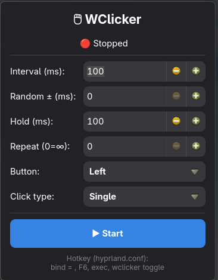

# 🖱 WClicker — Wayland Autoclicker

Fast GTK4 autoclicker for Wayland (Hyprland). Uses `/dev/uinput` directly — no X11, no ydotool required.



## Features

- Configurable click interval (ms)
- Random interval variation ± N ms (to avoid bot detection)
- Left / Middle / Right mouse button
- Click types: Single / Double / Hold
- Hold duration control
- Repeat limit (or infinite)
- CPS counter in real time
- CLI commands for hotkey integration

## Dependencies

```bash
# Arch / Manjaro
sudo pacman -S gtk4

# Ubuntu / Debian
sudo apt install libgtk-4-dev
```

Make sure your user is in the `input` group:

```bash
sudo usermod -aG input $USER
# then re-login
```

## Build

```bash
make
```

## Install (optional)

```bash
sudo make install
```

## Usage

```bash
./wclicker          # launch GUI
./wclicker toggle   # toggle start/stop
./wclicker start    # start clicking
./wclicker pause    # stop clicking
```

## Hotkey (Hyprland)

Add to `~/.config/hypr/hyprland.conf`:

```
bind = , F6, exec, wclicker toggle
```

Then reload: `hyprctl reload`

## License

MIT
